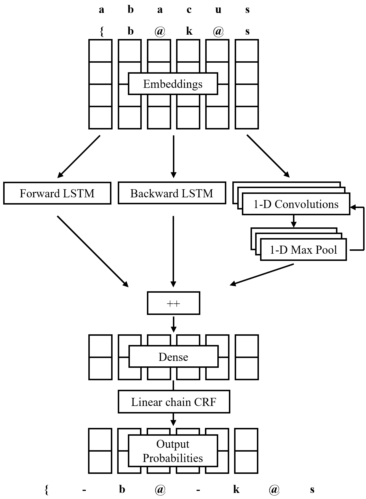
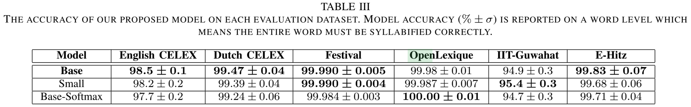

# Language-Agnostic Syllabification with Neural Sequence Labeling  

### Details  

This syllabifier treats the syllabification problem as a sequence labeling task where syllables can be trivialy recovered from boundary labels. Our network uses both an LSTM and a convolutional component. To decode an output sequence, a linear chain conditional random field (CRF) is used which provides an accuracy increase over a standard Softmax by a percentage point or two.  

Note that this repository contains code used in experimentation for research purposes. There may be issues hidden in places we don't know about. Feel free to contact us or open an issue.  

<p align="center">
  
  <p align="center"><i>Syllabification Network Diagram</i></p>
</p>

The repository structure and primary code files are adopted from [2] and can be found [here](https://github.com/UKPLab/emnlp2017-bilstm-cnn-crf).  

#### How well does this system work?  
The proposed model achieved accuracies higher than any other we could find on datasets from Dutch, Italian, French, and Basque languages and close to the best-reported accuracy for English. The results on Manipuri were weaker than others and may be due to having less labeled syllable data for Manipuri.  

<p align="center">
  
  <p align="center"><i>Syllabification Network Diagram</i></p>
</p>

### Data  

This folder should contain all the datasets to be used with the syllabifier. The processed form of the French [dataset](http://www.lexique.org/) exists in this folder. This freely-available dataset includes about 140,000 unique words with transcribed syllabification data [1]. To access the processed datasets that were used in the paper, contact the authors. This is much faster than trying to regenerate them from their sources. Included in this are some generation scripts and datasets from English, Dutch, French, Italian, Manipuri, and Basque. Data files are in CONLL format where each line contains a phone and either a 1 or 0 denoting the presence or absence of a syllable boundary, repsectively. Blank lines delineate a separation between two words.  

The example phone sequence `aRboRE` would be syllabified as `[aR] [bo] [RE]` and is represented in our data files as such:  
```
a	0
R	1
b	0
o	1
R	0
E	0
```

###  Citing lstm-syllabify  

If this project contributed to your research, please cite the following [paper](https://arxiv.org/abs/1909.13362): *Language-Agnostic Syllabification with Neural Sequence Labeling*.  

### Contact  

Corresponding author: Jacob Krantz  
Email: krantzja [at] oregonstate [dot] edu  

### Acknowledgments  

This research was supported in part by a Gonzaga University McDonald Work Award by Robert and Claire McDonald and an Amazon Web Services (AWS) grant through the Cloud Credits for Research program.  

### Citations  

```
[1] B. New, C. Pallier, M. Brysbaert, and L. Ferrand, “Lexique 2: A new
    french lexical database,” Behavior Research Methods, Instruments, &
    Computers, vol. 36, no. 3, pp. 516–524, 2004.

[2] N. Reimers and I. Gurevych, “Reporting score distributions makes a
    difference: Performance study of lstm-networks for sequence tagging,”
    in Proceedings of EMNLP 2017, 2017, pp. 338–348.
```
